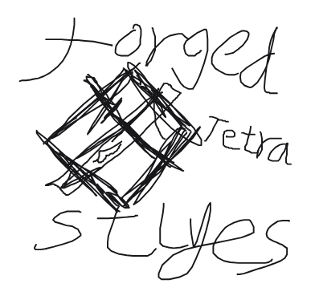

# 拔刀剑：百构流派

<p align="center">
  
</p>

<p align="center">
  <strong>Blade Tetra: Forged Styles</strong><br>
  面向 Minecraft 1.20.1 的 Tetra × 拔刀剑：重锋模块化锻刀与战斗流派扩展。
</p>

<p align="center">
  <a href="LICENSE"></a>
  
  
  
</p>

Blade Tetra 让玩家在 Tetra 工作台中锻造真正模块化的拔刀剑。刀身、柄、镡、鞘、鎺与柄头会共同决定武器的模型、材质、属性和战斗方式；同一把刀可以从开局一路改造到整合包毕业，而不是每隔几小时就被下一把成品刀替换。

## 核心内容

- **模块化锻刀**：自由组合刀身、刀柄、刀镡、刀鞘等部件，并继承 Tetra 的材料、完整度、加工、修复与打磨体系。
- **四种战斗流派**：本传、居合、连舞与断岳拥有不同的攻击节奏、范围、连段与风险收益。
- **名刀映锻**：研习重锋本体及标准附属名刀，将其刀鞘与完整镡柄仿造成可混装的 Tetra 部件；同源刀装会形成动态映锻契合。
- **隐藏传承与魂铭**：通过锻刀秘录探索赤月、镜花水月、千本樱、雷切等觉醒，并允许部分魂铭融合。
- **御影挑战**：拥有独立领域、阶段转换、战斗提示与演出的 Boss 挑战。
- **动态材料美术**：读取已加载的 Tetra 材料，为刀身、刀装和刀光生成对应视觉，同时保留手工制作的特殊材料表现。
- **存档与附属兼容**：旧刀自动迁移；标准重锋附属名刀可以自动发现，特殊模型则可通过适配器扩展。

## 文档入口

- [战斗与连招指南](docs/COMBAT_GUIDE.zh-CN.md)
- [特殊刀与隐藏传承 Wiki](docs/legacy-wiki/README.md)（答案默认折叠，避免意外剧透）
- [名刀映锻说明](NAMED_BLADE_IMPRINTING.md)
- [附属兼容说明](ADDON_COMPATIBILITY.md)
- [配置说明](CONFIGURATION.md)
- [1.5.1 更新日志](RELEASE_NOTES-1.5.1-ZH.md)

## 环境与安装

- Minecraft `1.20.1`
- Forge `47.4.0`（支持范围 `[47,)`）
- Tetra `6.3.0` 至 `6.x`
- mutil `6.2.0` 至 `6.x`
- SlashBlade: Resharped / 拔刀剑：重锋 `1.9.63` 至 `1.x`
- Player Animator `1.0.2-rc1+1.20`（可选，推荐）
- More Mod Tetra / MMT `2.2.941` 至 `2.x`（可选，整合包材料推荐）

将本模组及必需依赖放入 Forge 实例的 `mods` 目录即可。赤月·大正酒狐是独立的非商业衍生模型包，不包含在本仓库或 Mod JAR 中，可前往 [Akatsuki Taisho Wine Fox](https://github.com/Bluelgin/Akatsuki-Taisho-Wine-Fox) 获取。

## 构建

使用 Java 17，在仓库根目录运行：

```text
gradlew build
```

构建产物位于 `build/libs`。依赖从公开 Maven 仓库下载，不会被打入本模组 JAR。

## 许可证与第三方资源

本项目代码与自有资源以 [MIT](LICENSE) 许可发布。第三方来源与保留声明见 [THIRD_PARTY_NOTICES.md](THIRD_PARTY_NOTICES.md)。独立的赤月模型包采用 CC BY-NC-SA 4.0，不属于本仓库的 MIT 授权范围。

## 版本记录

## 1.5.1：旧刀减负

- 移除模块化名刀上已经废弃的完整校准快照，避免同一份研刀数据在多把刀上重复保存。
- 旧存档会在物品加载时自动迁移；模块、外观、觉醒、SA、附魔与玩家已经学会的映锻知识均会保留。
- 验证不同名刀部件混装，并让全部 15 把已支持名刀通过真实 Tetra 升级测试。

## 1.5.0：名刀映锻

- 在 Tetra 工作台正上方放置挂刀台，通过观察、描摹与锻打研习已经获得的重锋名刀。
- 将名刀刀鞘与完整镡柄转化为可自由混装的模块；同源组合获得依据原刀与当前刀动态计算的映锻契合。
- 自动发现标准重锋名刀定义，并为特殊模型预留数据驱动适配接口。
- 重做研刀界面、小游戏、长说明的 `[Alt]+ / [Alt]-` 展开方式与模块化刀的库存显示。

## 1.4.x：觉醒、御影与战斗表现

- 完善赤月、镜花水月、千本樱与雷切觉醒，加入魂铭融合、连锁导电和赤月斩杀等能力。
- 加入御影 Boss 挑战、独立领域、阶段转换、越界一闪与持续改变战场的断界赤火。
- 重做格挡、振刀、近战、SA 与阶段演出的视觉和音效，并持续修正边界碰撞、多人清理与技能伤害。
- 升级刀身及特殊材料美术，同时保持对光影和 Tetra 动态材料的兼容。

## 1.3.0：材料职责重构

- 不再扫描 `forge:ingots/*` 或自动生成保底金属；钢、锡、龙钢、魔力钢等第三方材料的数值、加工等级、修复来源与特殊效果由 Tetra 材料提供方负责。
- MMT 现作为推荐的可选材料提供方。安装后，其全部 `tetra:metal/*` 材料会自然进入模块化拔刀剑槽位，本模组不会复制或覆盖其数据。
- 原有 35 种手工第三方金属定义转为隐藏兼容层：旧刀继续保留原材料键、属性与修复能力，但新工坊不再显示这些旧选项。
- 动态材料外观继续读取 Tetra 的颜色、表面类型与材料分类，负责生成拔刀剑刀身、刀装、刀光与纯视觉粒子；马铃薯作为本模组原创材料继续完整保留。

## 1.2.9：薯条兼定

- 新增可加工为六个实体部件的马铃薯材料；六件套获得名称“薯条兼定”。
- 完整套装隐藏刀鞘与刀镡，并统一刀身、刀柄、鎺和柄头的薯黄色外观。
- 着火或火焰附加使其炸脆增伤并额外损耗耐久，浸水则回潮并降低伤害与攻速。

## 1.2.8：模块化刀装重制

- 重建简式、轻式与护手式刀镡：分别采用浅倒角圆形、薄型木瓜形镂空与厚缘圆角八角形，不再依赖同一旧圆盘的拉伸变形。
- 打刀、本式、胁差与野太刀获得更明确的长度、宽度和体量差异；本式现在使用独立模型轮廓。
- 精整基础、快拔与魂铭刀鞘，以及缠柄、迅捷与稳固刀柄的粗细、收束和比例关系。
- 新刀镡使用真实几何开孔并保留现有材料着色、UV、手持、断刀和物品栏显示。
- 本次更新不改变战斗数值、配方、耐久、模块数据、存档结构或武器 NBT。

## 1.2.7：通用 Tetra 附属材料外观

- 动态外观现在直接读取 Tetra 已加载材料的纹理色与材料分类；附属模组提供的金属、宝石、骨、木与石材会自动获得匹配的刀身配色、连续表面和刀光颜色。
- 原有无尽锭、龙钢、诅咒金属、暗黑金属与暮色材料等手工美术适配保持更高优先级。
- 通用解析已使用 More Material Tetra 2.2.941、Tetra 6.9.0 与 Curios 完成客户端实测；MMT 与 Curios 均不是本模组的前置，也不会被打包进发布文件。MMT 2.2.941 自身不兼容 Tetra 6.10+，使用该版 MMT 时应采用 Tetra 6.9.0。
- 本次适配只消费 Tetra 的通用材料数据，不复制或改写附属材料的数值、模块、图纸、饰品与特殊效果；材料属性仍完全由 Tetra 和材料提供方决定。
- Tetra 材料数据重载时会安全刷新动态纹理缓存，不新增武器 NBT 或存档迁移。

## 1.2.6：柄卷比例精整

- 柄卷浅色菱形明确表现为交叉缠绳间露出的鲛皮菱目，而不是重复排列的目贯。
- 标准柄调整为约 6 个菱目，迅捷柄约 7 个细密菱目，稳固柄约 5 个宽厚菱目，减少原先四个大开口造成的宝石排列感。
- 真正的目贯改为一至两处细长金属饰件：标准柄与迅捷柄各两处，稳固柄一处。
- 十六色地毯仍只染交叉缠绳，鲛皮、目贯和柄头继续保持各自材质。

## 1.2.5：十六色柄卷

- 模块化拔刀剑可与任意原版彩色羊毛地毯在普通工作台无序合成，为刀柄交叉缠绳应用对应的十六色柄卷。
- 染色仅改变缠绳；鲛皮底、目贯、柄头、刀柄材料、属性、耐久、附魔、杀敌数与传承状态均完整保留。
- 已染色的刀可以与另一种地毯再次合成并直接覆盖旧颜色；与线无序合成可恢复随刀柄材料变化的默认柄卷。
- 配方只接受一把模块化拔刀剑与一个装饰材料，不作用于普通重锋拔刀剑，也不接受多余物品。
- 柄卷颜色使用单个固定字节保存，覆盖时不累积历史，重置时删除字段。

## 1.2.4：Goety 与暮色锻材

- 新增 Goety 诅咒金属与黑暗金属的可选 Tetra 材料定义；直接识别其实际物品 ID，不要求 Goety 提供 Forge 通用锭标签。
- 新增暮色森林铁木、钢叶、骑士金属与炽铁的可选材料定义，并使用对应的官方物品 ID。
- 六种材料拥有独立的锻造属性、修理材料、中文/英文名称、刀身配色、连续表面纹理与刀光颜色。
- 诅咒金属、黑暗金属与炽铁拥有克制的专属发光层；铁木、钢叶和骑士金属分别采用层锻木纹、连续叶脉与甲片式锻面。
- 两个联动均不增加硬前置；未安装对应模组时，空的可选物品标签不会生成可用材料。

## 1.2.3：流派伤害再平衡

- 连舞流胁差刀身的材料伤害提取由 0.78 提高至 0.88，改善完整连段在实战中漏刀后明显刮痧的问题。
- 断岳流野太刀刀身的材料伤害提取由 1.30 降至 1.18；纵劈、横扫和破势追击倍率同步收紧至 1.12、0.92 和 1.05。
- 断岳继续保留重击、大范围、击退、破势和霸体特色，但单体持续伤害不再同时压过本传与连舞。
- 本次调整不改变流派操作、攻击范围、耐久、存档结构或武器 NBT。

## 1.2.2：踏步居合

- 模块化居合流现在复用重锋原生 Air Trick：从远处发动前向次元步后，会在原生瞬移完成时校正到目标近侧的安全地面，并自动转向目标，避免停在怪物侧上方而使居合挥空。
- 落点校正按玩家原接近方向搜索，依次检查碰撞箱、头部空间、脚下支撑和周边候选角度；没有安全地面时保留重锋原本的空中落点，不强制穿墙或落地。
- 从至少 3 格外成功完成校正，并在 12 tick 内使出蓄势拔刀，可获得 2.20 倍踏步居合倍率；贴脸蓄势拔刀继续保持 2.00 倍，仓促拔刀保持 1.60 倍。
- 居合拔刀命中后开启 8 tick 残心窗口；窗口内成功使用重锋原生后向次元步，会直接进入居合归鞘节点，形成“进场—拔刀—退场—再蓄势”的循环。
- 目标、距离奖励和残心均为玩家侧短时定长状态，超时、换刀、换流派、退出或切换维度后清理，不增加武器 NBT。

## 1.2.1：流派平衡

- 连舞流不再额外承受 10% 的流派伤害折减；胁差刀身提高基础伤害与材料耐久利用率，使高频多段攻击拥有合理的伤害耐久比。
- 断岳纵劈、横斩与破势追击收紧额外伤害乘区，继续保留大范围、强击退、破势与霸体定位。
- 居合追斩、返斩和收束斩获得小幅强化；普通拔刀与完美拔刀的起手倍率保持不变。
- 完全收刀至少 6 tick 后会响起轻微刀镡提示；完美拔刀拥有更窄、更亮的刀光，以及独立的暴击声与闪光反馈。
- 所有准备和视觉标记均为短时、定长状态，不向武器写入新的成长列表或命中历史。

## 1.2.0：本传流与无尽星锻

- 新增可正常锻造的“本式刀身”，进入本传流并完整沿用拔刀剑：重锋的地面、方向、潜行与空中攻击流程。
- 本传流不获得居合、连舞或断岳的特化战斗加成，定位为均衡、完整的原生重锋路线。
- 新增对 Re:Avaritia 与 Avaritia Lite 无尽锭的可选材料适配；未安装相关模组时不会生成材料，也不会增加硬前置。
- 无尽锭部件使用原创程序化深空、星云和稀疏星光表面，并通过现有发光通道显示星辉。
- 星空纹理与无发光结果继续进入有界缓存，不进行逐帧贴图重绘。

## 1.1.0：锻面精整

- 采用“默认玩家是顶级锻造师”的美术标准：刀身大面积保持干净抛光，不再用随机散点、孔洞或密集高频噪声表现材质。
- 刀身使用独立精整采样路径，屏蔽基础模板上会在缩放后形成脏点的重复锻纹，同时保留刃文、刃口、刀樋与结构明暗。
- 普通金属仅保留一条从鎺侧延伸至刀尖、只轻微弯曲一次的纵向锻流线；金、铜、下界合金分别使用克制的宽抛光、包浆色带与层压暗线。
- 石、木与骨材质移除刀身散点；晶体改为大块连续切面，黑曜石改为单条完整裂纹，龙钢保留辨识度明确的完整鳞片。
- 材质发光与觉醒魂铭同步移除孤立光点，改为依附连续锻流线、晶面边界、裂纹或魂铭主脉。
- 刀柄鲛皮等确有颗粒结构的部位保持原样；本次更新不修改配方、属性、NBT、模型或存档数据。

## 1.0.0 正式版

- 功能冻结于 Alpha 31：模块化锻刀、三种战斗流派、材质动态外观与发光、锻刀秘录、八条隐藏传承以及可选 Contract Blade 联动均纳入首个正式版。
- 修复手持普通非发光模块刀时，每帧重复生成并扫描 512×512 发光贴图导致的掉帧；无发光结果现在会安全缓存，并在资源重载时清理。
- 正式环境默认禁用开发工具；传承调试札仍无配方、不进入创造标签页，且必须同时满足用户名 `Dev` 与服务器显式启用开发工具。
- 1.0.0 不再加入新武器或系统，只处理发布阻断、崩溃、存档安全和严重性能问题。

## Alpha 31：千本樱与传承调试札

- 新增独立素材“樱魂晶”：由耀魂宝珠、紫水晶碎片与粉红色花簇合成，可在 Tetra 工坊刻写专属“樱晶魂铭”。
- 新增隐藏传承“千本樱”。候选刀必须使用胁差刀身、樱晶魂铭与樱吹雪鞘绘，因此固定进入连舞流且不会与赤月、镜花水月共享魂铭条件。
- 觉醒仪式要求在樱花林中无伤连续完成 16 次连舞有效命中，再于清晨以成功 SA 终结敌人；锻刀秘录新增对应落樱残页与完成记录。
- 觉醒后每 4 次连舞命中凝成一枚花印，最多 3 枚；下一次成功 SA 命中会让每枚花印化作 2 柄樱色幻影剑，能力冷却 8 秒。
- 千本樱获得粉白樱枝辉光、原创樱瓣粒子、独立隐藏进度与挑战进度；换掉魂铭、鞘绘、胁差刀身或发生断刀时传承沉眠，恢复原构装后继续生效。
- 新增命令获取的“传承调试札”，支持初心、百炼、万象、雷切、赤月、镜花水月、千本樱与 NBT 仙人。右键空气切换模式，右键方块切换目标，潜行右键执行；刀类模式读取副手物品。
- 调试札没有配方、不进入正常创造标签页，只响应用户名严格为 `Dev` 的玩家。本地 Forge 开发环境自动允许，正式环境还必须显式开启服务器配置 `enableDeveloperTools`。
- 樱魂晶、传承调试札与落樱残页使用原创 16×16 像素资产。

## Alpha 30：材质发光与魂铭辉光

- 为灵力、烈焰、雷霆、寒冰、末影、晶体、黑曜石裂纹、龙钢与相关自动发现材料新增真正的全亮发光层；暗处不再只是普通贴图提亮。
- 发光层使用重锋原生 luminous 渲染通道，在原有 512×512 动态材质图集上按需生成透明遮罩，不修改模型、战斗属性或物品 NBT。
- 普通晶体只让分面高光稀疏发亮；烈焰、雷霆、奥术与黑曜石分别沿热纹、电弧、符文和裂隙发光，避免整把刀无差别变成灯管。
- 觉醒魂铭获得紫金色细纹；赤月觉醒后切换为暗红血晶脉络，镜花水月觉醒后切换为青白镜纹。
- 断刀或传承沉眠时保留可辨认但显著黯淡的余辉，修复并重新满足魂铭条件后恢复完整亮度。
- 新增客户端配置 `config/blade-tetra-client.toml`：可关闭发光层，并分别调整材料发光和魂铭辉光强度。
- 基础材质贴图、刀光、SA 与幻影剑的现有颜色逻辑保持不变；关闭发光时完全回退到 Alpha 29.2 的普通动态材质表现。

## Alpha 22.2：材料耐久底板

- 修复模块化动态材质错误覆盖重锋物品栏耐久贴图的问题，恢复完整的材料底板、蓝色耐久层与红色断刀层。
- 模块化拔刀剑使用独立的实心菱形耐久模型，不再受重锋原版空心 `base` 网格限制；底板跟随 Tetra 刀身材料动态着色，铁钢、贵金属、黑曜石、晶体、龙钢和自动发现材料均使用现有确定性材料色板。
- 材料底板使用独立的中性顶点色绘制，不继承重锋为灰色原版底框准备的紫红损伤染色或物品附魔闪光；刀本体的附魔视觉不受影响。
- 蓝色剩余耐久与红色断刀层继续使用重锋原生纹理和位移逻辑，直接读取模块化拔刀剑与 blade state 共用的实际损伤和最大耐久。
- 关闭物品格底部的原版绿色耐久条，物品栏只保留重锋菱形耐久指示；手持、掉落和刀架模型不显示该背景。
- 材料底板从当前资源包提供的重锋耐久纹理动态生成并独立缓存，不增加物品 NBT，资源重载时会安全释放并重建。

## Alpha 22.1：铁打刀生存入口

- 新增无序配方：一把重锋木偶刀加三个铁锭，可在 2×2 玩家合成栏或工作台中锻成默认铁打刀。
- 成品安装铁制打刀刀身、简式铁镡、铁制鎺与柄头，以及基础木柄和木鞘，作为进入 Tetra 工作台继续改造的基础构造。
- 转换会继承木偶刀的重锋 blade state、附魔、击杀/锻造计数、所有者、荣耀之魂与断刀状态；只新增默认 Tetra 构造数据。
- 玩家取得木偶刀后会解锁铁打刀配方，合成书可显示配方及默认成品。

## Alpha 22：预设鞘绘与刀镡重制

- 新增五套原创预设鞘绘：黑漆金蒔绘、朱漆云纹、青海波、樱吹雪和紫电裂纹。
- 预设鞘绘先由纸与对应染料或材料无序合成为鞘绘卷，再将鞘绘卷与模块化拔刀剑无序合成即可套用；其他鞘绘卷或旗帜可直接替换，剪刀可移除。
- 鞘绘与旗帜鞘皮共用纯外观层，互相替换但不写入 Tetra 材料或重锋 blade state；刀鞘耐久、完整度、修理材料和部件能力保持不变。
- 重制简式、轻型与护身刀镡的轮廓，分别表现为丸形镡、木瓜形轻镡和圆角厚护镡；三者继续使用现有功能与数值，不新增属性 NBT。
- 刀镡获得独立的外缘、内圈、凹面和透空材质层次，并在物品栏展示组中适度朝向镜头，缩小后仍能辨认。
- 所有刀镡变化直接修改既有刀镡网格，没有额外挂件；完整刀、断刀、碎片、掉落物和物品栏模型继续由同一 Blender 流程生成。

## Alpha 21.1：旗帜鞘皮

- 新增纯外观的旗帜鞘皮系统，不新增模型顶点，也不改变81套主体模型。
- 将模块化拔刀剑与任意原版旗帜合成，可把旗帜底色和最多六层图案覆盖到现有刀鞘表面；再次与其他旗帜合成即可替换。
- 将带鞘皮的刀与剪刀合成可移除外观，剪刀只消耗1点耐久。
- 鞘皮只保存底色与原版旗帜图案列表，不写入Tetra模块材料或重锋刀状态；刀鞘耐久、完整度、修理材料、速拔效果和灵力效果继续完全由原刀鞘决定。
- 旗帜图案按刀鞘长度旋转并重新映射，动态贴图继续保留原刀鞘的明暗和漆面质感；鞘口、束环和鞘尻金具不会被覆盖。
- 物品提示会显示鞘皮底色、图案层数及应用/移除方法。
- Alpha 21 的额外绳结几何方案已完全撤销；本版本建立在重新生成并验证过的 Alpha 20 模型之上。

## Alpha 20：高精度材质与刀樋重制

- 动态材质图集由 128×128 提升为 256×256，细化纵向抛光、刃纹和部件边缘；动态贴图缓存上限由 256 组收紧为 128 组，避免分辨率提升后额外占用过多显存。
- 晶体材料由规则方格分面改为沿刀身延伸的长条分面、窄高光与稀疏闪点，减少展示架和近距离观察时的马赛克感。
- “血槽”统一改称“刀樋”：轻量路线表现为刀背侧的宽棒樋，加固路线表现为两道窄樋与中央加强筋。
- 刀樋不再把刀身下半区域整体替换成另一种材料色；现在以本体刀身色的凹陷明暗为主，仅在极细的樋沿或加强筋上保留少量加工材料点缀。
- 新锻造的宽棒樋仅接受金属材料，双筋樋接受金属或锻造梁；旧存档中的木、骨等历史组合仍可正常读取，不需要迁移物品 NBT。

## Alpha 19.1：模块化妖刀来源收束

- 仅对 `blade_tetra:modular_slashblade` 禁用重锋原本的“附魔＋铁砧改名”
  妖刀捷径；铁砧自定义名称仍可正常显示和清除。
- 模块化拔刀剑现在必须具有重锋的默认妖刀状态才能被识别为妖刀，觉醒魂铭
  正是当前主动获得该状态的模块化成长路线。
- 从其他拔刀剑转换而来且原本就具有默认妖刀状态的刀继续保留妖刀资格。
- 普通重锋拔刀剑、封印判断、附魔类型、断刀类型及其他 `SwordType` 完全不变。

## Alpha 19：魂铭解放妖刀

- 新增可选的“刀铭”次要槽位，不修改现有七个部件，也不要求迁移旧存档。
- 耀魂铁锭可刻写普通魂铭，提供少量耐久与魔力容量，但不会直接成为妖刀。
- 耀魂宝珠可刻写觉醒魂铭；觉醒魂铭自动附加零数值的“魂契”并设置重锋原生
  妖刀状态，因此无需用铁砧覆盖构装名称。
- 拆除或替换觉醒魂铭时只会移除“魂契”，不会删除玩家的其他附魔。玩家仍可
  继续通过重锋原本的“附魔＋铁砧自定义名称”路线成为妖刀。
- 觉醒后，自动构装名称优先获得“魂契”称号；若转换前的刀本来就是默认妖刀，
  魂铭拆除时会恢复原状态，不会误清除重锋已有的妖刀属性。
- 魂铭位于刀柄内部，当前只使用带颜色区分的 Tetra 部件图标，不增加新的模型
  组合；未来可再为觉醒魂铭增加专属发光刃纹。

## Alpha 18：构装命名

- 模块化拔刀剑名称现在由现有 Tetra 构造实时推导，不新增名称 NBT。
- 刀身材料决定名称前缀，刀身模块决定打刀、胁差或野太刀。
- 其他部件优先组成“一闪、疾风、镇魂、不动、飞燕、断岳、幽影、秋水”等构装称号。
- 未形成组合时只显示一个最显著的部件称号，避免名称过长。
- 更换模块后名称立即变化；铁砧设置的自定义名称仍然优先。

## Alpha 17：Tetra 打磨闭环

- 模块化拔刀剑每次实际消耗耐久时都会推进 Tetra 的打磨与主要模块成长；
  强化鎺成功免除耐久、耐久事件将消耗降为零时不会获得虚假的打磨进度。
- 打磨进度使用 Tetra 原生的 `honing_progress`、`honing_available` 和
  `honing_count`，继续遵守整合包中的 Tetra 成长开关、基础阈值和完整度倍率。
- 刀身开放五级伤害打磨与五级速度打磨，分别使用 Tetra 原生
  `blade_hone/damage` 和 `blade_hone/speed` 改良。
- 刀柄开放五级伤害打磨与五级速度打磨，分别使用 Tetra 原生
  `hilt_hone/damage` 和 `hilt_hone/speed` 改良。
- 所有图纸仅把 Tetra 原版打磨路线映射到 `slashblade/blade` 与
  `slashblade/tsuka`，复用原版数值、完整度消耗、工具门槛、图标和中英文文本。
  鞘、镡、鎺、柄头与血槽仍通过部件分支提供能力，不占用打磨界面。
- 打磨属性由现有模块属性汇总自动接入普通攻击、流派连段和 SA，不新增第二套
  属性 NBT；转换配方仍会保留已有的 Tetra 打磨进度。

## Alpha 16：SA 与幻影剑材质视觉

- 模块化拔刀剑释放次元斩、Drive 远程剑气以及普通、螺旋、烈焰、暴雨和
  风暴幻影剑时，会继承当前 Tetra 刀身材料的刀光颜色。
- 环形斩、樱之终焉、波刃等使用重锋刀光实体的招式继续沿用 Alpha 15 的
  材质配色，因此常用 SA 和远程攻击现在使用同一套材质视觉规则。
- 次元斩与 Drive 会在材料色基础上少量提亮，避免多层特效或半透明远程剑气
  把黑曜石、下界合金等深色材料压成近黑；幻影剑保持原始材料色。
- 本次只覆盖颜色，不修改 SA 的伤害、消耗、锁定、数量、速度、尺寸、轨迹
  或生命周期，也不影响普通重锋拔刀剑。
- 材质仅在实体生成时从持刀者的模块化刀身解析，并写入重锋本来就会同步的
  实体颜色字段；不新增刀具或飞行实体 NBT。

## Alpha 15.2：连段手感清理

- 居合短收刀的最低接招门槛由 12 帧缩短为 7 帧，保留可辨认的收刀动作，
  同时减少连续输入时不必要的停顿。
- 居合输入缓存与动作门槛现在共用同一个数值，避免快速点击的释放时机与
  实际可接招帧不同步。
- 移除断岳纵劈周围的材质粒子，保留材质配色的大型刀光、伤害判定、破势、
  击退和有限霸体；断岳命中时不再被额外粒子遮挡。

## Alpha 15.1：双段重击与居合收刀

- 断岳流由三段铺垫改为“纵劈 → 横劈”的两段循环。纵劈使用重锋
  `COMBO_A4_EX`，造成 35% 额外伤害、强击退、破势，并在前段获得有限霸体；
  判定收窄为约 45 度、6.25 格的正面区域。
- 断岳横劈使用 `COMBO_A1`，造成 8% 额外伤害，判定扩大为约 110 度、
  5.25 格的宽扇区，专门负责群体清扫。
- 居合流缩短为“拔刀居合 → 返身横斩 → 短收刀”。只有第一段继续获得
  单体锁定、必定暴击、居合伤害和速拔鞘加成。
- 所有自定义动作重新保留重锋原生的最低接招帧：居合拔刀 15 帧、返斩
  5 帧、短收刀 12 帧；断岳纵劈 22 帧、横劈 5 帧。快速点击不能再跳过
  命中时间轴。
- 临时输入缓存扩展到断岳两段和居合收刀。有效帧之前的单次点击会在门槛
  到达后自动释放；缓存不写入物品或实体 NBT。
- 已登记但不再从根节点进入的旧居合追斩、收束斩和断岳抬刀节点继续保留，
  避免旧存档的拔刀剑连段注册数据失效。

## Alpha 15：材质刀光

- 重锋刀光现在直接读取 Tetra 刀身模块的材料：钢铁、铜合金、贵金属、
  下界合金、黑曜石、晶体及常见附属材料拥有对应颜色。
- 龙炎钢、龙霜钢、龙霆钢、幻灵锭、神灵金属及其他火焰、寒冰、雷电、
  灵力、末影或晶体材料，在居合起手和断岳终结时产生少量对应粒子。
- 流派继续控制刀光形态：居合起手窄而明亮，连舞刀光收窄以减少多段遮挡，
  断岳前两段保持普通尺寸，终结纵劈使用宽大的重型刀光。
- 未知附属材料使用与动态刀具贴图相同的材料 ID 确定性配色思路，不会因
  重启或客户端不同而随机变化。
- 刀光颜色直接写入重锋已同步的刀光实体，不增加刀具 NBT；粒子仅用于表现，
  不附加元素伤害或状态效果。
- Alpha 14.1 为断岳抬刀增加 450 毫秒接招宽限，并提供一个不持久化的单次
  输入缓存。过早点击会在动作进入有效帧后释放纵劈，切换武器、流派或连段
  后缓存会自动清除。

## Alpha 14：流派连段重构

- 居合流不再反复播放同一次拔刀。地面普通攻击现在按“拔刀居合 → 横向追斩
  → 反向回斩 → 收束斩”循环；中途停手会进入重锋原有的收刀动作，下一轮
  重新从居合起手。
- 只有居合起手享受单体锁定、必定暴击、伤害加成和速拔鞘加成，后续追斩
  用于连段衔接，不会重复触发起手爆发。
- 断岳流改为“宽幅起手 → 斜向抬刀 → 断岳纵劈”的三段重击节奏。只有
  最后一段纵劈获得大范围、霸体、破势、高伤害和群体击退。
- 连舞流保留重锋成熟的原生 B 系连段，作为三种流派的连贯性基准。
- 新连段节点直接复用重锋 1.9.65 的动作帧、命中时间轴、移动和命中特效，
  只重排动作转移；没有新增持久 NBT，也不改变普通重锋拔刀剑。

## Alpha 13：通用材料兼容层

> 1.3.0 起该功能已停止提供；以下内容仅保留为历史记录。第三方材料现由 MMT 等 Tetra 材料提供方负责。

- 服务器在数据包加载完成后检查所有非空的 `forge:ingots/*` 物品标签。
  如果某个标签没有被已有 Tetra 材料引用，也没有同名材料定义，Blade Tetra
  会自动生成一个可用于模块化拔刀剑的 `tetra:metal` 材料。
- Tetra 本体、Blade Tetra 手工适配和整合包数据包中的定义始终优先，自动项
  不会覆盖它们。自动材料使用保守的铁级基线：5.5 硬度、3.6 密度、
  3.2 韧性、400 耐久、5/2 完整度、90 魔力容量、铁工具等级与铁锤要求。
  这保证冷门材料可用，同时避免错误猜测其他模组的终局强度。
- 整合包作者只需加入正常的 Tetra 材料 JSON 即可覆盖自动项；重新加载后，
  自动材料会自行让位。运行中的 `/reload` 也会把结果同步给在线客户端。
- `config/blade_tetra-common.toml` 中的 `automatic_materials.enabled` 可关闭
  自动发现；`automatic_materials.blacklist` 可填写材料名或完整标签，例如
  `mythril` 或 `forge:ingots/mythril`。
- 未知材料贴图优先按名称归入晶体、寒冰、灵力、火焰、重金属、铜合金或
  折叠锻造等表面族；仍无法分类时，由材料 ID 生成确定性配色。同一种材料
  在不同客户端上不会随机变色，也不会增加额外 NBT。

一个面向 Minecraft 1.20.1 Forge 的 Tetra × 拔刀剑：重锋
（SlashBlade: Resharped）兼容模组。

## 目标版本

- Minecraft 1.20.1
- Forge 47.4.0
- Tetra 6.3.0–6.x
- mutil 6.2.0–6.x
- 拔刀剑：重锋 1.9.63–1.9.65
- Player Animator 1.0.2-rc1（可选，推荐安装）

## Alpha 12.1 已实现

- `blade_tetra:modular_slashblade` 仍继承重锋的 `ItemSlashBlade`，保留拔刀、
  连段、SA、击杀数、所有者、断刀状态和本体动画。
- 不再把拔刀剑伪装成普通 Tetra 剑。现已使用独立的 `slashblade/*` 构造：
  - 刀身（主要模块）
  - 柄（主要模块）
  - 鞘、镡、鎺、柄头、血槽（次要模块）
- 新增 7 套拔刀剑专用模块定义和对应工坊图纸，并为 5 个次要模块提供专用界面排布。
- Alpha 1–3 的 `sword/*` 刀会在首次加载时自动迁移；材料、锻造进度、
  槽位强化数据与附魔归属会一并换到新的 `slashblade/*` 槽位。
- Tetra 模块决定攻击属性、攻击速度、最大耐久、完整度和修理材料。
- 当前耐久只保存在重锋的 blade state 中；Tetra 读取的是同一整数耐久视图，
  不会产生两套互相冲突的 Damage NBT。
- 任意重锋拔刀剑与一把 Tetra 模块化剑无序合成，可转换成模块化拔刀剑。
  原刀的能力状态和附魔会保留，Tetra 剑的材料和锻造进度会导入拔刀剑专用槽位。
- 已登记 Tetra 工坊修理图纸，并接入模块使用效果与锻造进度。
- 修正物品栏和快捷栏中模型过小、偏移的问题。
- 新增第一版战斗流派系统，并直接使用重锋的 `ComboRoot` 和 `ComboState`
  注册表，不覆盖原 SA：
  - 打刀刀身：居合流，以快速收束的高暴击拔刀连段为主。
  - 胁差刀身：连舞流，攻击速度快、单击伤害较低，使用多段连续攻击。
  - 野太刀刀身：断岳流，攻击速度慢、威力与击退更高。
- 流派直接由 Tetra 刀身模块推导，不额外保存一份流派 NBT；换刀身后会自动
  切换连段根节点，普通重锋拔刀剑不会受到流派事件影响。
- Alpha 7 重新划分三种流派的战斗职责：
  - 居合流：有效距离缩短为约 3 格，普通拔刀只锁定窄角度内的一个目标；
    保留精准暴击与速拔鞘爆发，不再兼任大范围清怪。
  - 连舞流：维持约 4.5 格的标准拔刀剑范围和多段连击，作为兼顾单体、群体与
    机动性的泛用路线。
  - 断岳流：重斩有效距离扩大到约 6 格，判定为宽大的正面扇区，并继续提供
    高伤害、硬直和群体击退。
- 断岳重斩前 11 游戏刻获得有限霸体：来自敌人的伤害降低 35%，且不会被击退；
  这不是无敌，仍会受到伤害，也不防御无来源或绕过护甲的环境伤害。
- 断岳命中会施加 3 秒“破势”；3 游戏刻后，施加者的下一次直接斩击造成
  15% 额外伤害并消耗破势。第二段重斩不会立刻吃掉自己刚施加的破势。
- 居合与断岳的刀光显示尺寸同步缩小或放大，使视觉范围与实际判定更接近。
- Alpha 8 开始接入模块化美术资源。第一批外观直接由刀身、刀鞘、刀镡和刀柄
  四个模块共同决定：
  - 打刀保持标准长度；胁差缩短并收窄刀身；野太刀加长并加宽刀身。
  - 基础刀鞘维持标准轮廓；速拔鞘更轻薄；灵力鞘更厚重。
  - 简式镡保持标准尺寸；轻镡缩小；护御镡扩大。
  - 缠柄保持标准尺寸；迅捷柄更短更细；稳固柄更长更厚。
- 已从 Blender 母版自动生成 81 种组合模型，每个模型均包含重锋要求的完整刀、
  断刀、刀刃碎片、刀鞘、掉落物和物品栏显示组。换装模块后 blade state 会同步
  指向新模型，但不增加第二套模块或外观 NBT。
- Blender 母版、Alpha 8 预览工程及可重复导出脚本保存在项目的 `art/blender`
  与 `tools/blender` 目录中，后续可继续加入鎺、柄头、血槽和材料配色。
- Alpha 9 将模块模型重新映射到一张 128×128 分区图集，刀身、刀刃、刀镡、
  刀柄、刀鞘和金属配件不再共用木色区域。
- 第一套标准材质包含冷色钢刃与克制的刃纹、铁制刀镡、靛蓝柄卷、黄铜配件和
  黑褐漆鞘；81 种几何组合复用同一图集，不需要为每种组合复制整张贴图。
- 完整刀、断刀、刀刃碎片、刀鞘和物品栏模型全部使用相同的部件材质规则；
  UV 源工程、贴图生成脚本和带材质预览均保存在 `art` 与 `tools` 目录中。
- Alpha 10 会直接读取七个 Tetra 模块现有的材料变体，并在客户端按材料组合
  动态生成 128×128 贴图。外观数据不另存 NBT，重锋 blade state 仍只保留
  `standard.png` 作为安全回退。
- 刀身控制钢材或其他主体材质，血槽控制刃纹带；刀镡拥有独立材质；刀柄主体
  由柄材决定，柄卷点缀使用柄头材质；刀鞘主体由鞘材决定，鞘上金属带与鎺使用
  鎺材质。
- 已覆盖模块可用的原版 Tetra 木材、石材、铁、铜、金、下界合金、钻石、
  绿宝石、紫水晶、骨和杆材。附属模组提供的未知材料也会得到由材料 ID
  稳定推导的配色。
- 相同材料组合复用同一张动态贴图，客户端最多保留 256 个近期组合；资源包
  重载后会重新生成，不会预制成数量爆炸的 PNG 文件。
- Alpha 11 在动态配色上增加确定性的材料表面：
  - 锻铁/钢材具有锻造颗粒，锻造梁及名称含 Damascus、pattern-welded、
    folded-steel 的附属材料具有波状叠锻刃纹。
  - 黑曜石具有紫色分叉裂纹；钻石、绿宝石、紫水晶和宝石类材料具有分面高光。
  - 铜与铜合金具有少量铜锈；下界合金具有暗色夹杂；木、石、骨也分别显示
    木纹、矿物颗粒和骨质孔隙。
  - 灵力、烈焰和末影类材料具有高亮脉冲纹理，但目前只是贴图高亮，
    尚未使用着色器实现真正的自发光。
- 常见附属材料名称已建立外观兼容规则，包括 steel、silver、tin、lead、
  nickel、invar、aluminium、osmium、zinc、bronze、brass、electrum、
  signalum、lumium、enderium、uranium、ruby、sapphire 等。
- Alpha 12 曾新增 23 种基于 Forge 通用锭标签的完整 Tetra 材料定义；1.3.0 起这些定义仅作为旧武器的隐藏兼容层：
  - 基础与工程合金：铝、黄铜、青铜、康铜、琥珀金、殷钢、铅、镍、锇、
    银、钢、锡、锌与铀。
  - 高级科技合金：信素、流明、末影、精炼荧石与精炼黑曜石。
  - 魔法或幻想金属：钴、魔力钢、元素钢与泰拉钢。
- 这些材料拥有独立的硬度、密度、韧性、耐久、完整度、魔力容量、工具等级、
  加工等级、中文名称和修理材料。所有拔刀剑金属槽位均接受
  `tetra:metal/*` 材料。由于 Tetra 6.13 的材料加载器固定读取 `tetra`
  命名空间，兼容定义也遵循这一数据格式。
- 兼容不硬依赖任何附属模组：材料引用 `forge:ingots/*` 标签。未安装材料来源
  时不会出现可用锭；安装遵循 Forge 标签规范的模组后会自动进入工坊与修理系统。
  模组整合包仍可通过数据包覆盖数值，或继续添加自己的 Tetra 材料。
- Alpha 12.1 为常见冒险整合包追加五种终局材料：
  - 冰火传说：龙炎钢、龙霜钢、龙霆钢和灵锭。
  - 诡厄巫法：启示录：神灵金属。
- 五种材料通过带 `required: false` 的物品标签接入，因此不会把冰火传说或
  诡厄巫法设为硬前置。龙钢参照原模组的终局装备定位保留高耐久与高加工门槛；
  灵锭偏轻灵和魔力容量；神灵金属偏高密度与高魔力容量。
- 原模组的 16×16 锭贴图只用于确认配色方向，不复制到 Blade Tetra。运行时会
  在自身 128×128 刀具图集上生成龙炎熔纹、龙霜晶纹、龙霆电弧、幻灵流光和
  神灵金属熔脉，因此刀身、镡、柄与鞘仍保持各自的 UV 和材料边界。
- 三种流派暂时复用重锋现有动作帧，待玩法和数值稳定后再制作专属动画与模型。
- 新增 11 种带实际战斗功能的部件分支，使各部位不再只是数值换皮：
  - 刀鞘：速拔鞘强化居合起手；灵力鞘强化 SA 后 2 秒内的追击。
  - 刀镡：轻镡偏攻速；护御镡可在潜行持刀时消耗耐久减免近战或投射物伤害。
  - 刀柄：迅捷柄偏攻速；稳固柄偏完整度并在命中时提供少量 Rank 稳定。
  - 鎺：精密鎺扩大 SA 精准蓄力窗口；强化鎺有概率免除耐久消耗。
  - 柄头：轻型柄头偏攻速；重型柄头让符合条件的暴击斩击挑起目标。
  - 血槽：轻量血槽以最大耐久换取明显攻速，加固血槽则维持耐久路线。
- 部件效果直接从当前 Tetra 模块推导，不额外保存效果开关 NBT；更换部件后立即
  切换对应能力。护御镡不防御虚空等无来源或绕过护甲的环境伤害。
- 当前以木偶母版的拓扑为基础，但已经使用模块化几何和 Blade Tetra 自有贴图；
  包含刀鞘、完整刀、断刀、碎片和物品栏显示组。

## 当前边界

- 本传流完整使用重锋原生攻击树；居合、连舞与断岳复用重锋动作帧并重排连段转换，当前不计划另制专属动画。
- Alpha 4 的旧刀迁移会保留材料和通用强化数据；Tetra 特殊剑刃模块没有一一对应
  的拔刀剑版本时，会迁移成相同材料的基础打刀刀身。
- 已接入 Tetra 的通用使用效果和锻造进度；依赖普通剑攻击事件的少数特效还未逐一
  映射到重锋连段事件。
- 当前声明支持重锋 1.9.63–1.x，不再支持缺少所需事件接口的重锋 1.8.x，
  也不支持已停更的原版
  SlashBlade 0.1.2。
- 更新大型内容模组前仍建议备份存档，并在反馈问题时附上 Forge、Tetra 与重锋版本。

## 构建

使用 Java 17 运行：

```text
gradlew build
```

开发环境会从公开仓库下载依赖，不会把依赖打进本模组 jar。
